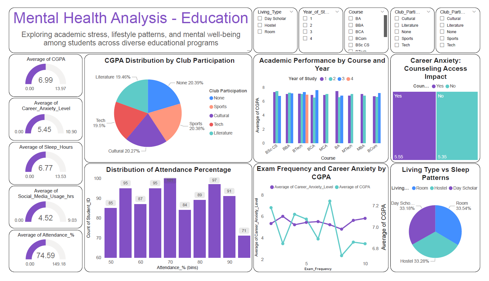

# 📦 Mental Health Analysis – Education Dashboard  
A Power BI dashboard project that analyzes mental health indicators among students across diverse educational programs in India.  
This project uses synthetic data generated using Python to explore key factors such as academic stress, social media usage, sleep patterns, career anxiety, and support systems.

---

# 📊 Dashboard Highlights
- ✅ Academic performance: Average CGPA by Course and Year of Study
- 📈 Career Anxiety Levels Across Student Profiles
- 📈 Counseling Access impact on Career Anxiety Levels
- 🏠 Living Type Impact on Sleep and Anxiety
- 🎯 Club Participation vs Academic Performance
- 📝 Attendance % and Exam Frequency Insights

---

# 💻 Tools & Technologies
- 🐍 Python (Pandas, NumPy) – Synthetic dataset generation
- 📊 Microsoft Power BI – Data visualization
- 📁 CSV – Dataset storage format

---

# 🔗 Live Project Page
👉 [View on GitHub Pages](https://harshad912004.github.io/Mental_Health_Analysis-Education/)

---

# 🖼️ Preview

---

# 📥 Downloads
- [Mental_Health_Analysis-Education.pbix](Mental_Health_Analysis-Education.pbix) – Power BI File
- [Mental_Health_Analysis-Education.pdf](Mental_Health_Analysis-Education.pdf) – Dashboard PDF Export
- [Education_Dataset.csv](Education_Dataset.csv) – Synthetic Dataset

# 👨‍💻 About  
**Harshad Dhongade**  
MCA Student | Aspiring Data Analyst | Passionate about educational data insights and mental health analytics.
